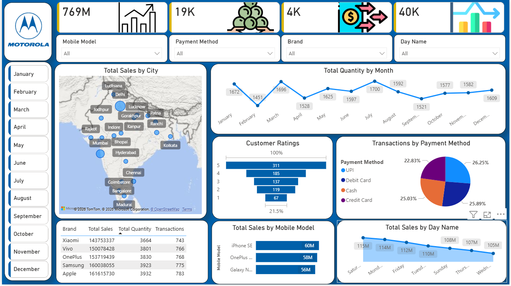

# Mobile Sales Dashboard | Power BI

## Overview
This project is an interactive Power BI dashboard created to analyze mobile sales performance and visualize business insights using sales data.

## Objective
The objective of this dashboard is to track sales performance and identify trends across different mobile brands and regions.

## Tools Used
- Power BI
- Excel
- Power Query
- DAX

## Key Metrics
- Total Sales
- Total Transactions
- Quantity Sold
- Average Sales

## Features
- Interactive dashboard
- Brand-wise sales analysis
- Region-wise performance analysis
- KPI tracking
- Filters and slicers for data exploration

## Key Insights
- Identified top-performing mobile brands
- Compared sales performance across regions
- Monitored sales trends through visual reports

## Project Files
- `Mobile_Sales_Dashboard.pbix`
- `Dataset.csv`

## Dashboard Preview
Add dashboard screenshot here.

## Future Improvements
- Add forecasting
- Connect live data source
- Expand customer insights

## Author
Gaurav Kushwah

## Dashboard Preview

